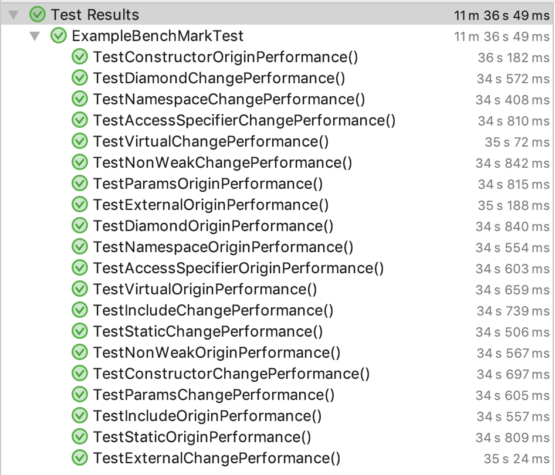

# Test Result

How long it takes to pre-process C++ program ( x 1,000 )

|        **구분**        |   Time   |
| --------------------  | -------- |
| **Access Specifier**  | 23.495 s |
|    **Constructor**    | 10.731 s |
|      **Diamond**      | 13.386 s |
|**External Definition**| 27.702 s |
|       **Include**     | 17.836 s |
|      **Namespace**    | 33.414 s |
|      **NonWeak**      |  3.246 s |
|       **Params**      | 39.958 s |
|       **Static**      | 10.966 s |
|  **Virutal Nonweak**  | 10.761 s |

How long it takes to run a executable after compiling all C++ programs ( x 10,000 )

|        **구분**        |  Origin  | Converted | difference |
| --------------------  | -------- | --------- | ---------  |
| **Access Specifier**  | 34.603 s | 34.810 s  |  +0.207 s  |
|    **Constructor**    | 36.182 s | 34.697 s  |  -1.485 s  |
|      **Diamond**      | 34.840 s | 34.572 s  |  -0.268 s  |
|**External Definition**| 35.188 s | 35.240 s  |  +0.052 s  |
|       **Include**     | 34.557 s | 34.739 s  |  +0.182 s  |
|      **Namespace**    | 34.554 s | 34.408 s  |  -0.146 s  |
|      **NonWeak**      | 34.567 s | 34.842 s  |  +0.275 s  |
|       **Params**      | 34.815 s | 34.605 s  |  -0.210 s  |
|       **Static**      | 34.809 s | 34.506 s  |  -0.303 s  |
|  **Virutal Nonweak**  | 34.659 s | 35.720 s  |  +0.061 s  |

